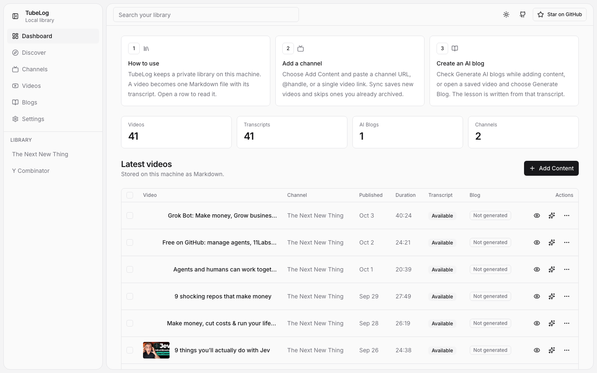
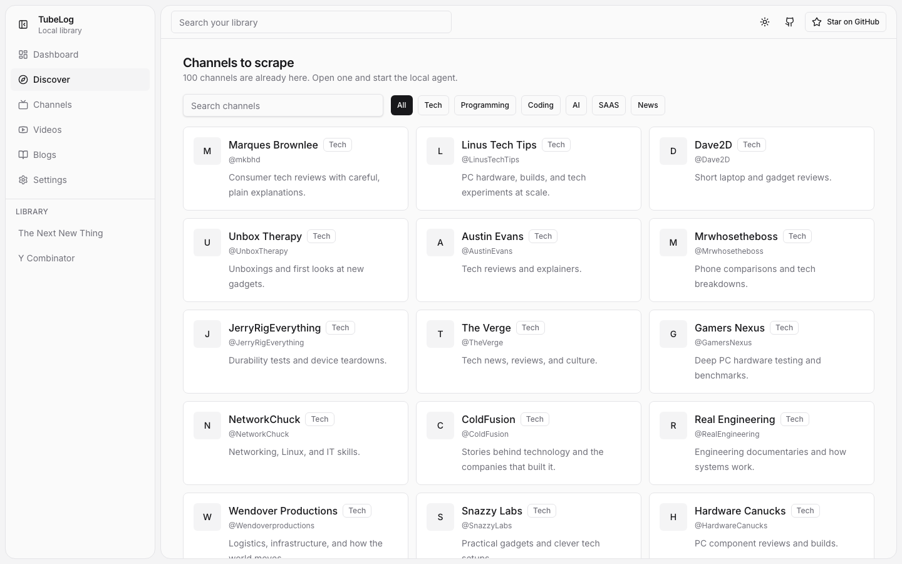
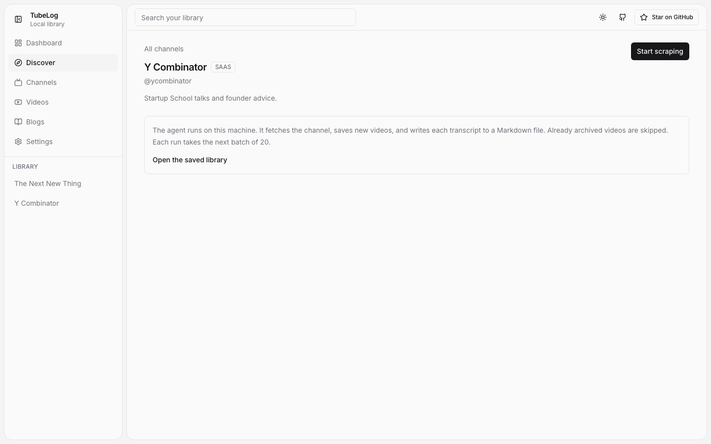
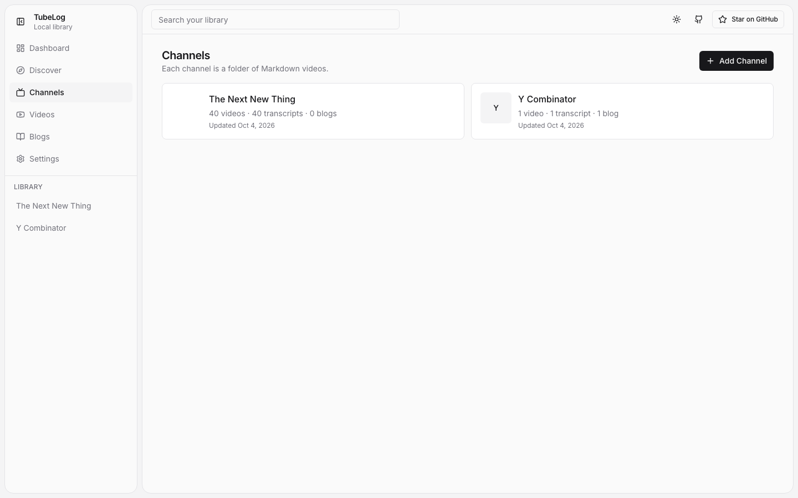
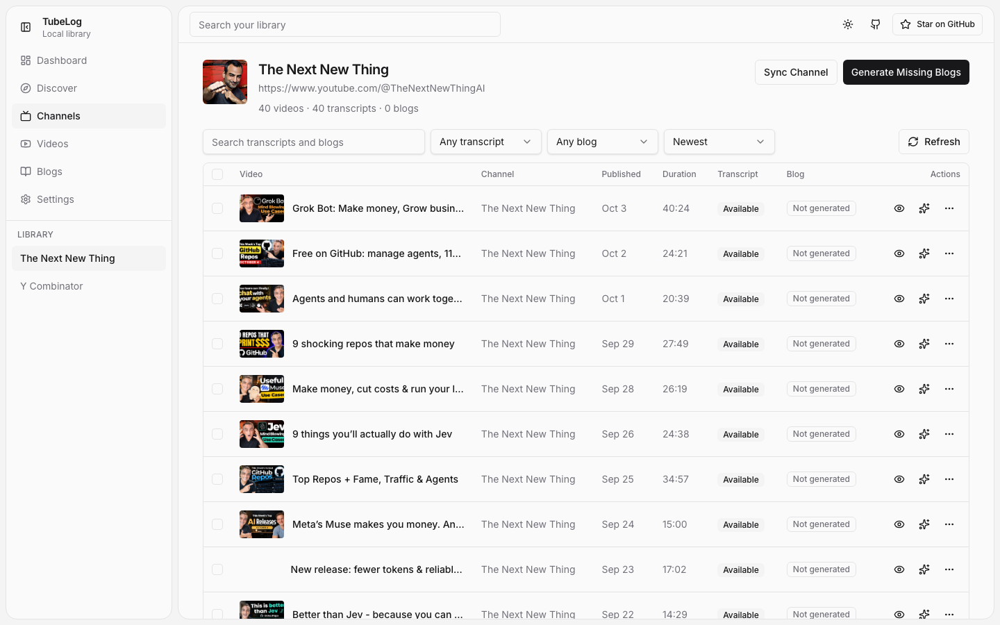
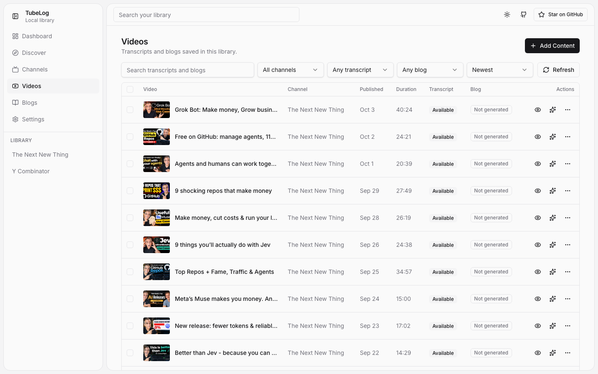
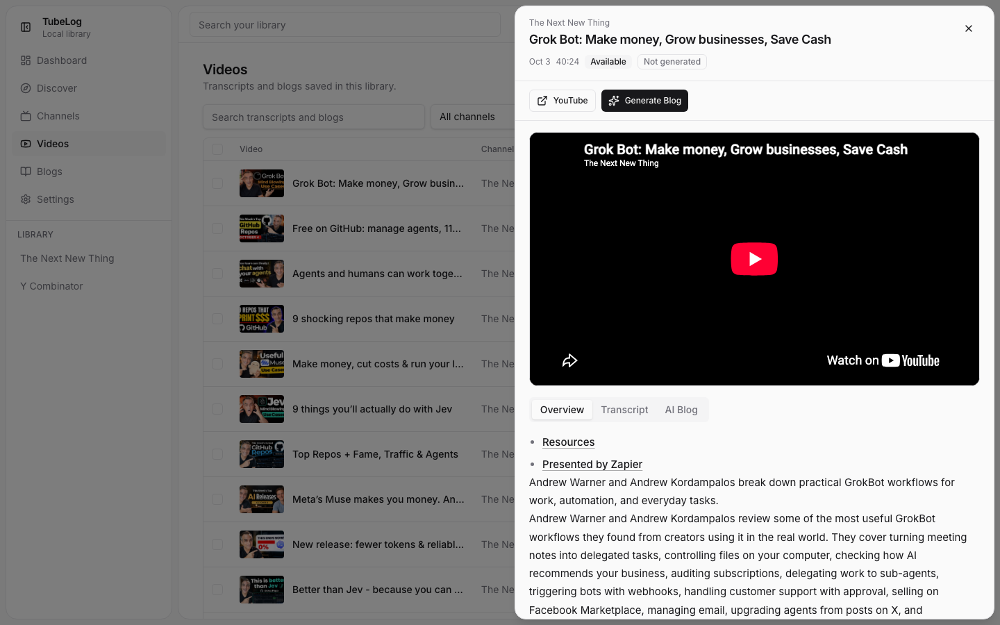
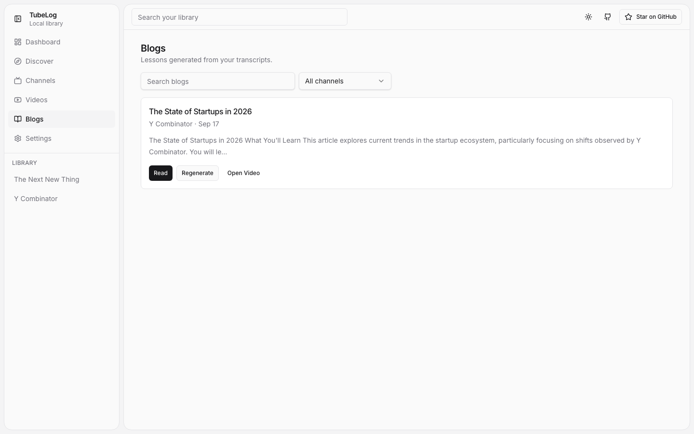
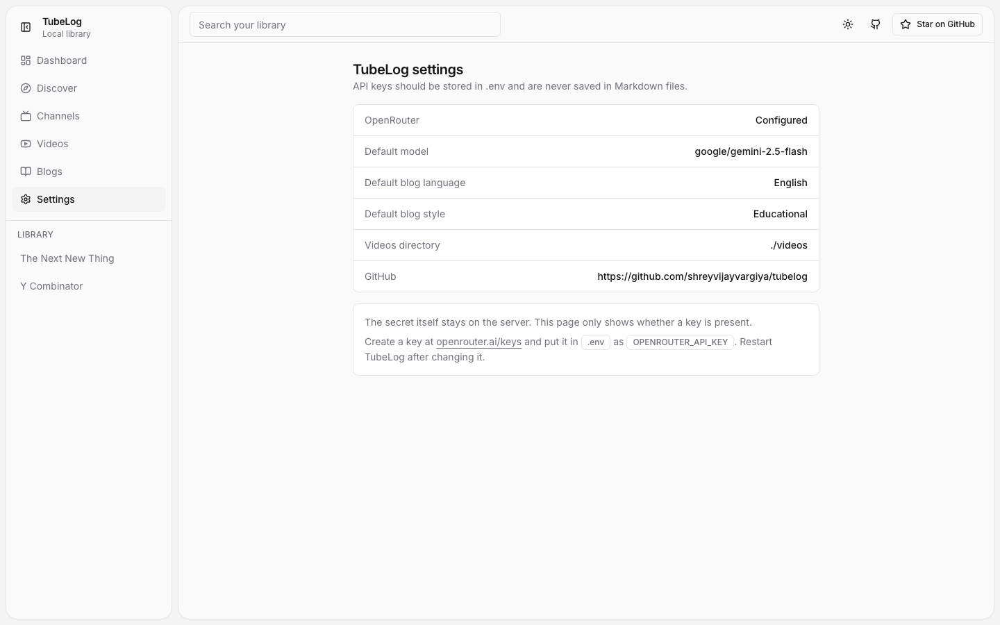

# TubeLog

Turn YouTube into your local Markdown learning library.

[](https://www.youtube.com/watch?v=S-4vWLyG5gw)

[Watch the explainer on YouTube](https://www.youtube.com/watch?v=S-4vWLyG5gw)

Fetch channels. Archive transcripts. Generate AI blogs. Browse everything in a local dashboard.

TubeLog is a local YouTube archive, a Markdown knowledge base, and an AI study writer. The video is the source. The transcript is the raw knowledge. The blog is the lesson. The filesystem is the database.

## What is TubeLog?

TubeLog keeps a private learning library on your machine.

```text
YouTube channel or video
        ↓
metadata + transcript
        ↓
videos/<channel>/<video-id>.md
        ↓
optional OpenRouter blog
        ↓
dashboard, CLI, and API
```

Nothing is stored in a hosted database. API keys stay in `.env` and are never written into Markdown files.

## Features

- Add a YouTube channel or a single video
- Fetch channel videos from the public channel page and Innertube continuation
- Fetch transcripts from watch-page captions, the Android player, and `youtube-transcript-plus`
- Skip a video when captions are missing and keep going
- Save one Markdown file per video
- Run the same sync again without duplicating files
- Generate an educational blog with OpenRouter only when you pass `--ai` or `generateBlog: true`
- Turn a transcript into an Instagram carousel with a theme, then render the slide images
- Search the local library
- Browse channels, transcripts, and blogs in a Vite + React dashboard
- Start from 100 built-in channels across Tech, Programming, Coding, AI, SAAS, and News
- Use the same core from the CLI, the HTTP API, and the dashboard

YouTube Shorts are skipped. Each sync archives up to `sync.maxVideos` new videos (default 20). Run sync again to continue through the channel.

## Dashboard

After `npm run dev`, open http://localhost:3000. An empty library asks for a channel or video. After the first archive, the home page shows counts and a video table. Discover already lists 100 channels you can scrape locally, including Y Combinator and Greg Isenberg.

### Home

Three onboarding cards, library counts, and the latest Markdown videos.



### Discover

Search and filter channels for Tech, Programming, Coding, AI, SAAS, and News. A card opens that channel.



### Discover a channel

**Start scraping** sits at the top right. It runs the local agent for that channel and archives the next 20 transcripts. Already archived videos are skipped. Run it again to continue.



### Channels

Channels already saved on this machine. Each card opens that folder of Markdown files.



### Channel

One saved channel, with search, sync, and a way to generate blogs that are still missing.



### Videos

Every archived video, across channels.



### Video

A row opens a side panel. The YouTube video plays in the panel, with the overview, transcript, and AI blog in tabs.



### Blogs

Lessons written from transcripts. Open one to read it, regenerate it, or jump back to the video.



### Settings

Public config only. The OpenRouter key stays in `.env` and is never written into Markdown.



## Architecture

```text
                    TubeLog
        local YouTube knowledge base
                      │
          ┌───────────┴───────────┐
          │                       │
     YouTube core             OpenRouter
          │                       │
   channel / video / transcript   blog
          └───────────┬───────────┘
                      │
                  sync engine
                      │
               videos/<channel>/*.md
                      │
        ┌─────────────┼─────────────┐
        │             │             │
       CLI           API       Dashboard
```

`src/youtube.js`, `src/transcript.js`, `src/storage.js`, `src/sync.js`, and `src/ai.js` are the only business logic. The CLI, Hono API, and React dashboard call those modules. They do not each talk to YouTube on their own.

```text
YouTube
   ↓
TubeLog core
   ↓
Markdown files
   ↓
CLI    API    Dashboard
                ↓
            learning UI
                ↓
             AI blogs
                ↓
        future MCP / Claude
```

## Quick Start

```bash
npm install
cp .env.example .env
npm run dev
```

Open http://localhost:3000.

The dev dashboard is Vite on port 3000. It proxies `/api` to the Hono server on port 8787.

Archive a channel without spending OpenRouter credits:

```bash
npm run tubelog -- sync https://www.youtube.com/@fireship
```

Archive and write blogs for new transcripts:

```bash
npm run tubelog -- sync https://www.youtube.com/@fireship --ai
```

## Open Dashboard

Development: http://localhost:3000

Production, after `npm run build && npm start`: http://localhost:3000

## CLI

```bash
node src/cli.js <command>
# or, after npm install
npx tubelog <command>
# or
npm run tubelog -- <command>
```

| Command | What it does |
| --- | --- |
| `tubelog start` | Serve the API and the built dashboard on port 3000 |
| `tubelog channel <url-or-handle>` | Resolve a channel and print its metadata. Does not archive videos |
| `tubelog transcript <video-url-or-id>` | Fetch a transcript and save one Markdown file |
| `tubelog sync <channel>` | Archive new videos. Does not call OpenRouter |
| `tubelog sync <channel> --ai` | Archive new videos and write missing blogs |
| `tubelog sync <channel> --force` | Refresh transcripts for the newest batch |
| `tubelog sync <channel> --limit 5` | Cap how many new videos this run archives |
| `tubelog blog <video-url-or-id>` | Generate a blog for one archived or new video |
| `tubelog videos` | List local videos |
| `tubelog channels` | List local channels |
| `tubelog search <query>` | Search local Markdown |
| `tubelog help` | Print usage |

Example output:

```text
✓ Channel resolved: Fireship
✓ Found 30 videos
✓ Already archived: 20
↓ Processing: 10 new videos
✓ Transcript saved: The one OpenAI announcement that can actually make you money...
⚠ Transcript unavailable: Some video title
⚠ Skipping video: Some video title — request blocked
```

## API

Base URL in development: `http://localhost:8787`  
Through the dashboard proxy, and in production: `http://localhost:3000`

Errors return JSON:

```json
{ "error": "What went wrong" }
```

Each route also has an npm script. These call the API in-process, so the dev server does not need to be running. Pass arguments after `--`.

| Script | Route |
| --- | --- |
| `npm run api:health` | `GET /api/health` |
| `npm run api:config` | `GET /api/config` |
| `npm run api:channels` | `GET /api/channels` |
| `npm run api:channel -- fireship` | `GET /api/channels/:channel` |
| `npm run api:videos -- fireship --blog` | `GET /api/videos` |
| `npm run api:video -- No-JPdFvYWU` | `GET /api/videos/:id` |
| `npm run api:transcript -- No-JPdFvYWU` | `GET /api/videos/:id/transcript` |
| `npm run api:blog -- No-JPdFvYWU` | `GET /api/videos/:id/blog` |
| `npm run api:markdown -- No-JPdFvYWU` | `GET /api/videos/:id/markdown` |
| `npm run api:search -- agents --channel fireship` | `GET /api/search` |
| `npm run api:youtube:channel -- https://youtube.com/@fireship` | `POST /api/youtube/channel` |
| `npm run api:youtube:transcript -- No-JPdFvYWU` | `POST /api/youtube/transcript` |
| `npm run api:sync -- https://youtube.com/@fireship --ai` | `POST /api/youtube/sync` |
| `npm run api:ai:blog -- No-JPdFvYWU --style tutorial` | `POST /api/ai/blog` |
| `npm run api:ai:instagram -- No-JPdFvYWU --theme hook` | `POST /api/ai/instagram` |
| `npm run api:regenerate -- No-JPdFvYWU` | `POST /api/videos/:id/regenerate` |
| `npm run api:delete -- No-JPdFvYWU` | `DELETE /api/videos/:id` |

`npm run api -- help` prints the same list. `api:sync` and `api:youtube:transcript` accept `--ai`. `api:sync` also accepts `--force` and `--limit N`.

### `GET /api/health`

Response:

```json
{ "ok": true, "service": "tubelog" }
```

```bash
curl http://localhost:3000/api/health
```

### `GET /api/config`

Public settings only. The OpenRouter key is reported as configured or not configured. The secret is not returned.

```bash
curl http://localhost:3000/api/config
```

### `GET /api/channels`

```json
{
  "channels": [
    {
      "id": "UCsBjURrPoezykLs9EqgamOA",
      "name": "Fireship",
      "handle": "Fireship",
      "slug": "fireship",
      "url": "https://www.youtube.com/@Fireship",
      "description": "",
      "thumbnail": "https://...",
      "videoCount": 12,
      "transcriptCount": 11,
      "blogCount": 2,
      "updatedAt": "2026-10-03T00:00:00.000Z"
    }
  ]
}
```

```bash
curl http://localhost:3000/api/channels
```

### `GET /api/channels/:channel`

`:channel` is the folder slug, such as `fireship`.

Response: `{ "channel": { ... }, "videos": [ ... ] }`

```bash
curl http://localhost:3000/api/channels/fireship
```

### `GET /api/videos`

Query: `channel` (slug), `blog=generated` to return only videos that have a blog, including a short `excerpt`.

```bash
curl http://localhost:3000/api/videos
curl "http://localhost:3000/api/videos?blog=generated"
```

### `GET /api/videos/:id`

Full video, including `transcript` and `blog`.

```bash
curl http://localhost:3000/api/videos/No-JPdFvYWU
```

### `GET /api/videos/:id/transcript`

```json
{
  "videoId": "No-JPdFvYWU",
  "transcript": "...",
  "language": "en",
  "available": true
}
```

```bash
curl http://localhost:3000/api/videos/No-JPdFvYWU/transcript
```

### `GET /api/videos/:id/blog`

```json
{
  "videoId": "No-JPdFvYWU",
  "blog": "# Title\n\n...",
  "generated": true,
  "model": "google/gemini-2.5-flash",
  "generatedAt": "2026-10-03T00:00:00.000Z"
}
```

```bash
curl http://localhost:3000/api/videos/No-JPdFvYWU/blog
```

### `GET /api/videos/:id/markdown`

Returns the raw Markdown file.

```bash
curl http://localhost:3000/api/videos/No-JPdFvYWU/markdown
```

### `GET /api/search?q=`

Query: `q` (required), optional `channel` slug.

```json
{
  "query": "ai agents",
  "results": [
    {
      "videoId": "No-JPdFvYWU",
      "title": "How AI Agents Work",
      "channel": "Fireship",
      "url": "https://www.youtube.com/watch?v=No-JPdFvYWU",
      "match": { "field": "transcript", "excerpt": "…ai agents…" }
    }
  ]
}
```

```bash
curl "http://localhost:3000/api/search?q=ai+agents"
```

### `POST /api/youtube/channel`

Resolves a channel and saves `channel.json`. It does not archive every video. Use sync for that.

Request:

```json
{ "query": "https://youtube.com/@fireship" }
```

`channel` and `url` are accepted as aliases of `query`.

Response: `{ "channel": { ... } }`

```bash
curl -X POST http://localhost:3000/api/youtube/channel \
  -H "Content-Type: application/json" \
  -d '{"query":"https://youtube.com/@fireship"}'
```

### `POST /api/youtube/transcript`

Request:

```json
{ "video": "https://youtube.com/watch?v=No-JPdFvYWU", "generateBlog": false }
```

`video` may be a watch URL, a youtu.be URL, or an 11-character id. `generateBlog: true` also writes a blog when `OPENROUTER_API_KEY` is set.

Response:

```json
{
  "videoId": "No-JPdFvYWU",
  "title": "The one OpenAI announcement that can actually make you money...",
  "url": "https://www.youtube.com/watch?v=No-JPdFvYWU",
  "transcript": "...",
  "language": "en",
  "available": true,
  "saved": true,
  "blogGenerated": false
}
```

```bash
curl -X POST http://localhost:3000/api/youtube/transcript \
  -H "Content-Type: application/json" \
  -d '{"video":"https://youtube.com/watch?v=No-JPdFvYWU"}'
```

### `POST /api/youtube/sync`

Request:

```json
{
  "channel": "https://youtube.com/@fireship",
  "generateBlog": false
}
```

`generateBlog: true` writes blogs for new transcripts and for archived videos that do not have one yet, up to `sync.maxVideos` blog calls in that run. Optional fields: `force`, `maxVideos`, `model`, `style`, `language`.

Response:

```json
{
  "channel": { "name": "Fireship", "slug": "fireship" },
  "found": 30,
  "alreadyArchived": 20,
  "processed": 10,
  "saved": 10,
  "blogsGenerated": 0,
  "failed": 0,
  "exhausted": false,
  "videos": [
    {
      "id": "No-JPdFvYWU",
      "title": "...",
      "url": "https://www.youtube.com/watch?v=No-JPdFvYWU",
      "action": "saved",
      "transcriptAvailable": true,
      "blogGenerated": false,
      "error": ""
    }
  ]
}
```

`action` is `saved`, `blog`, or `failed`.

```bash
curl -X POST http://localhost:3000/api/youtube/sync \
  -H "Content-Type: application/json" \
  -d '{"channel":"https://youtube.com/@fireship","generateBlog":true}'
```

Archive without AI:

```bash
curl -X POST http://localhost:3000/api/youtube/sync \
  -H "Content-Type: application/json" \
  -d '{"channel":"https://youtube.com/@fireship","generateBlog":false}'
```

### `POST /api/ai/blog`

Request:

```json
{
  "video": "No-JPdFvYWU",
  "model": "google/gemini-2.5-flash",
  "style": "educational",
  "language": "English",
  "includeTakeaways": true,
  "includeOriginalVideo": true,
  "includeCodeExamples": false
}
```

`video` may also be a YouTube URL. TubeLog loads the local Markdown file, fetches a transcript when the file does not have one, writes the blog into that same file, and returns it.

```json
{
  "videoId": "No-JPdFvYWU",
  "title": "...",
  "url": "https://www.youtube.com/watch?v=No-JPdFvYWU",
  "blog": "# Title\n\n...",
  "model": "google/gemini-2.5-flash",
  "generatedAt": "2026-10-03T00:00:00.000Z"
}
```

```bash
curl -X POST http://localhost:3000/api/ai/blog \
  -H "Content-Type: application/json" \
  -d '{"video":"https://www.youtube.com/watch?v=No-JPdFvYWU"}'
```

Styles: `educational`, `tutorial`, `explainer`, `technical`, `beginner`.

### `POST /api/ai/instagram`

Writes a six-slide Instagram carousel from a saved transcript and draws each slide with Google Nano Banana. The slide copy uses an OpenRouter text model. Image generation uses OpenRouter credits.

Request:

```json
{
  "video": "No-JPdFvYWU",
  "theme": "hook",
  "model": "google/gemma-4-31b-it:free",
  "imageModel": "google/gemini-2.5-flash-image"
}
```

`theme` is one of `hook`, `lesson`, `steps`, `quotes`, `myth`, `list`. Each theme is a hardcoded hook for the carousel. `model` writes the words. `imageModel` draws the images.

```bash
curl -X POST http://localhost:3000/api/ai/instagram \
  -H "Content-Type: application/json" \
  -d '{"video":"No-JPdFvYWU","theme":"hook"}'
```

`GET /api/videos/:id` includes the carousel. Each slide image is `GET /api/videos/:id/instagram/:index`.

### `POST /api/videos/:id/regenerate`

Same options as `/api/ai/blog`. Always writes a new blog over the existing one.

```bash
curl -X POST http://localhost:3000/api/videos/No-JPdFvYWU/regenerate \
  -H "Content-Type: application/json" \
  -d '{"style":"tutorial"}'
```

### `DELETE /api/videos/:id`

Removes that video's Markdown file.

```json
{ "deleted": true, "videoId": "No-JPdFvYWU" }
```

```bash
curl -X DELETE http://localhost:3000/api/videos/No-JPdFvYWU
```

## YouTube Channel Sync

```bash
tubelog sync https://www.youtube.com/@fireship
```

This resolves the channel, pages through videos, and saves a Markdown file for each new video. Existing video ids are left alone. Captions are fetched one at a time. A missing or blocked transcript does not stop the channel.

```bash
tubelog sync https://www.youtube.com/@fireship --ai
```

Same archive, and then OpenRouter writes a blog when the transcript exists and the file does not already have one. Blogs are generated one at a time.

`--force` refetches transcripts for the newest batch. Without `--ai`, an existing blog is kept.

A channel URL, `@handle`, channel id (`UC...`), or `/channel/UC...` URL all work. A watch URL is rejected on the channel command so it is not stored as a channel.

## AI Blog Generation

OpenRouter writes a lesson from the transcript. The prompt in `prompts/blog-writer.md` tells the model to teach the ideas, stay inside the source, and keep code that the transcript actually contains.

The default model is `google/gemini-2.5-flash`. Change it with `OPENROUTER_MODEL` or `ai.model` in `tubelog.config.js`.

Sync without `--ai`, and `generateBlog: false`, never call OpenRouter.

## Instagram carousels

Open a saved video and choose **IG Posts**, next to **AI Blog**. **Create IG posts** opens the same kind of dialog as blog generation.

Pick one of six themes. The theme is the hook for the carousel:

| Theme | What it does |
| --- | --- |
| Scroll-stopping hook | A sharp claim, then the proof |
| Teach one idea | One lesson, and a takeaway on the last slide |
| Step by step | Numbered steps from the video |
| Quote cards | Short lines the video actually says |
| Myth and fact | A common belief against what the video says |
| Save-worthy list | A list of points, then a close |

A FREE OpenRouter text model writes six slides and a caption from the transcript. Google Nano Banana (`google/gemini-2.5-flash-image`) draws a portrait image for each slide. Nano Banana 2 Lite and Nano Banana 2 are the other image choices. Image calls spend OpenRouter credits. The FREE text models do not.

The carousel renders in the IG Posts tab. Copy the caption from there. Images are saved beside the video:

```text
videos/<channel>/ig/<video-id>/
  carousel.json
  1.png
  2.png
```

Run it again to replace that carousel. Deleting the video removes the images too.

```bash
npm run api:ai:instagram -- No-JPdFvYWU --theme lesson
```

## Filesystem

```text
videos/
  fireship/
    channel.json
    No-JPdFvYWU.md
    abc123def45.md
    ig/
      No-JPdFvYWU/
        carousel.json
        1.png
```

`channel.json` holds the channel id, name, handle, URL, description, and thumbnail.

Each video file:

```markdown
---
video_id: "No-JPdFvYWU"
channel_id: "UCsBjURrPoezykLs9EqgamOA"
channel: "Fireship"
title: "How AI Agents Work"
url: "https://www.youtube.com/watch?v=No-JPdFvYWU"
thumbnail: "https://i.ytimg.com/vi/No-JPdFvYWU/hqdefault.jpg"
published_at: "2026-10-01"
duration: 347
transcript_available: true
blog_generated: false
---

# Transcript

Full transcript here.
```

When a blog exists, the same file continues:

```markdown
---

# AI Generated Blog

# Title

## What You'll Learn

...

---

# AI Metadata

model: google/gemini-2.5-flash
generated_at: 2026-10-03T00:00:00.000Z
```

`blog_generated: false` omits the AI sections. The original watch URL is kept in the frontmatter.

## Duplicate Handling

Sync is idempotent. The video id is the filename.

If `videos/fireship/No-JPdFvYWU.md` already exists, the next sync skips it. New uploads are archived. A second folder is not created for the same channel id.

If the file has a transcript and no blog, `sync --ai` writes the blog into that file. It does not create a second transcript file.

`--force` refreshes metadata and the transcript for the newest batch.

## Configuration

`tubelog.config.js`:

```js
export default {
  videosDir: "./videos",
  github: "https://github.com/shreyvijayvargiya/tubelog",
  ai: {
    enabled: false,
    model: "google/gemini-2.5-flash",
  },
  blog: {
    language: "English",
    style: "educational",
  },
  sync: {
    maxVideos: 20,
    maxPages: 12,
    delayMs: 350,
  },
};
```

`ai.enabled` is only the default checkbox in the dashboard. The server still generates a blog only when the CLI flag or the request says so.

Environment variables:

| Variable | Purpose |
| --- | --- |
| `OPENROUTER_API_KEY` | Required for blogs. Never written to Markdown |
| `OPENROUTER_MODEL` | Overrides `ai.model` |
| `TUBELOG_VIDEOS_DIR` | Overrides the videos directory |
| `TUBELOG_GITHUB_URL` | Overrides the GitHub link in the navbar |
| `PORT` | API port. `8787` in dev, `3000` in production |

Replace `github` in `tubelog.config.js` with your repository URL. The dashboard links there. It does not invent a star count.

## OpenRouter API Key

1. Create an account at https://openrouter.ai
2. Create a key at https://openrouter.ai/keys
3. Copy `.env.example` to `.env`
4. Set `OPENROUTER_API_KEY`
5. Set `OPENROUTER_MODEL` if you want a different model
6. Restart TubeLog

`.env` is gitignored. Do not commit it.

## Building Your Own SaaS

TubeLog runs as a local app, a CLI, or an HTTP API. The dashboard is a client of that API. You can host the Hono server, point a web app at it, and keep or replace the filesystem store. The YouTube, transcript, sync, and blog functions do not import the dashboard.

This repository does not include accounts, billing, or cloud storage.

## Development

```bash
npm install
npm run dev
```

- Dashboard: http://localhost:3000
- API: http://localhost:8787

```bash
npm run tubelog -- videos
npm run tubelog -- search agents
```

## Production

```bash
npm run build
npm start
```

`npm start` serves the built dashboard and the API together on http://localhost:3000.

`tubelog start` does the same thing.

## Troubleshooting

**Transcript unavailable.** The video has no captions TubeLog could read. The Markdown file is still saved with `transcript_available: false`, and the channel sync continues. `tubelog sync <channel> --force` tries again.

**YouTube blocked the request.** A 429 or consent wall is treated as retryable. That video is not marked as permanently missing, so a later sync can retry it.

**OpenRouter rejected the key.** `POST /api/ai/blog` returns an error and does not print the key. Replace `OPENROUTER_API_KEY` and restart.

**Instagram images fail with a credits error.** Slide copy can use a FREE text model. Drawing the carousel uses Google Nano Banana, which spends OpenRouter credits.

**Sync stopped after 20 videos.** That is `sync.maxVideos`. Run sync again. Already archived videos are skipped, and the next new videos are saved.

**A channel of Shorts looks empty.** Shorts are not archived.

**Port already in use.** Stop the other process on 3000 or 8787, or set `PORT` for the API.

## Contributing

Issues and pull requests are welcome. Keep the core in `src/` so the CLI, API, and dashboard stay on one implementation. Do not add a database, auth, or a second YouTube client for the UI.

## Roadmap

Not in this version:

- MCP / Claude integration
- Cloud storage
- Scheduled sync
- Hosted SaaS
- More content sources

## License

MIT. See [LICENSE](LICENSE).
